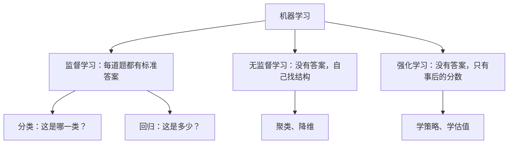
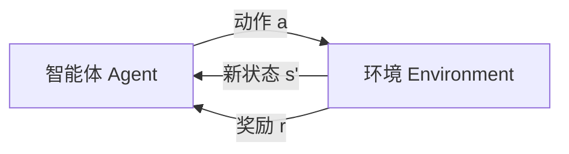

# 机器学习是什么：把"回归"和"强化学习"讲透

> 一句话总结：分类回答"是哪一类"，回归回答"是多少"；监督学习像有老师批改每一道题，强化学习像只有裁判在终场报一个比分——哪一步走对了，全靠自己复盘。

这份笔记不是 `01-what-is-machine-learning/docs/en.md` 的翻译。原文把机器学习的全景铺了一遍，但对"回归（Regression）"和"强化学习（Reinforcement Learning）"这两个概念只各给了几句话。这里换一套讲法：先用最短的篇幅把全景交代清楚，然后把主要笔墨花在这两个概念上——它们的名字从哪来、到底在解决什么问题、内部的关键机制是什么、以及它们如何一路通到今天的大语言模型。

---

## 1. 地基：机器学习"学"的到底是什么

传统编程是：人写规则，程序拿规则去处理数据，得到输出。机器学习把方向反过来：**人给数据和期望的输出，算法自己找出规则。**

拿垃圾邮件过滤举例。传统做法是手写几百条规则——"含有'免费领取'就标记为垃圾邮件"——然后发件人换个说法，规则就失效，你永远在补规则。机器学习的做法是给算法几万封已经标好"垃圾/正常"的邮件，让它自己归纳判别模式；对手换招时，重新训练就行，不用重写代码。

训练出来的"模型"，本质上就是被编码成一堆数字（参数、权重）的规则。所谓学习，就是用优化算法反复调整这些数字，直到模型在已知数据上的输出足够接近期望输出，并且**在没见过的新数据上也依然管用**（这叫泛化，是机器学习的全部意义所在——只在见过的数据上表现好，那叫背题，不叫学会）。

**判断一个问题适不适合机器学习，就看一件事：你是更容易"写出规则"，还是更容易"给出例子"。**规则清晰简单的（税费计算、单位换算），直接写代码；规则说不清、例子一大把的（识别照片里的猫、判断评论的情绪），才轮到机器学习上场。

---

## 2. 三种教法：有老师、没老师、只有裁判

同样是"教"，机器学习有三种根本不同的教法。想象同一个学生：

- **监督学习（Supervised Learning）**：老师发例题，而且每道题都附标准答案。学生的任务是从"题目 → 答案"的对应关系里归纳出解题套路，以便面对没见过的新题也能答对。
- **无监督学习（Unsupervised Learning）**：只发例题，不发答案。学生的任务是自己发现题目之间的结构——哪些题是同一类的、哪些特征总是结伴出现。
- **强化学习（Reinforcement Learning）**：既不发例题也不发答案。学生直接上场做事，环境只在事后给一个分数。没人告诉他哪一步做对了、哪一步做错了，他要自己从分数里倒推出"哪些行为值得多做"。



| | 监督学习 | 无监督学习 | 强化学习 |
|---|---|---|---|
| 数据长什么样 | 输入 + 标准答案（标签） | 只有输入 | 没有现成数据集，经验是自己"行动"出来的 |
| 反馈信号 | 每个样本都有明确的对错 | 没有反馈 | 延迟的、往往稀疏的分数 |
| 学到的东西 | 从输入到输出的映射 | 数据的内在结构 | 一套行为策略 |
| 典型例子 | 垃圾邮件识别、房价预测 | 用户分群、降维 | 下棋、机器人控制、RLHF |

本文两个主角在这张图里的位置：**回归是监督学习的半壁江山**（另一半是分类），**强化学习自成一派**，是三种范式里和另外两种差别最大的一个。

---

## 3. 回归（上）："回归"这个怪名字是怎么来的

"回归"（regression）字面意思是"退回去"，听起来和"预测数值"八竿子打不着。这个名字其实是一桩十九世纪的历史遗案。

统计学家高尔顿（Francis Galton）研究父母身高和子女身高的关系时发现一个现象：特别高的父母，孩子平均而言比父母矮一些；特别矮的父母，孩子平均而言比父母高一些。子女的身高整体在向人群的平均值"退回"。他把这个现象叫作"向平庸回归"，也就是今天说的**均值回归**。而他研究这个现象所用的工具——给两组变量拟合一条直线——被后人沿用下来，"回归"就从一个遗传学观察，变成了"拟合数值关系"这门技术的名字。

所以别被名字迷惑，现代意义上的回归和"退回"没有任何关系，它就是一句话：**预测一个连续的数值。**

它和分类是监督学习的两种任务，区别一张表说清：

| | 分类 Classification | 回归 Regression |
|---|---|---|
| 回答的问题 | "是哪一类？" | "是多少？" |
| 输出 | 离散的类别 | 连续的数值 |
| 例子 | 这封邮件是不是垃圾邮件 | 这套房子能卖多少钱 |
| 输出空间 | {猫, 狗, 鸟} | 任意实数 |
| 常用损失函数 | 交叉熵 | 均方误差 MSE、平均绝对误差 MAE |

很多问题两种建模都行，选哪种取决于你拿结果做什么决策：预测股票"涨还是跌"是分类，预测"明天收盘价是多少"是回归；预测用户"会不会流失"是分类，预测"这个用户未来一年会带来多少收入"是回归。

一个实用的判断法：**如果输出的两个候选值取平均还有意义，那就是回归**——房价 100 万和 120 万的平均是 110 万，说得通；**如果取平均没有意义，那就是分类**——"猫"和"狗"的平均是什么？没有这种东西。

最后埋一个名字陷阱：**逻辑回归（Logistic Regression）名字里带"回归"，干的却是分类的活。**它内部确实在拟合一个连续值（属于某一类的概率），但最终交付的是类别判断。第一次遇到它时，不要被名字骗到。

---

## 4. 回归（下）：一条线是怎么被"学"出来的

以最简单的一元线性回归为例：给一堆散点 (x, y)，找一条直线来概括它们的关系：

```text
ŷ = w·x + b
```

ŷ 读作"y hat"，表示预测值。w 是斜率，b 是截距——它们就是这个模型全部的参数。所谓训练，就是找到让预测最不离谱的那组 w 和 b。

"最不离谱"必须有一个能算出来的定义，这就是**损失函数**。回归最常用的是均方误差（MSE, Mean Squared Error）：

```text
MSE = (1/n) · Σ (ŷᵢ - yᵢ)²
```

把每个点的预测误差平方后取平均。为什么要平方？三个理由，一个比一个实际：

1. **让正负误差不能互相抵消。**一个点高估 5、另一个点低估 5，直接求和是 0，看起来"完美"，实际上两个都错了。平方把所有误差都变成正数。
2. **大错要重罚。**误差 1 平方后还是 1，误差 10 平方后是 100。MSE 天然对离谱的大错极度敏感，逼着直线优先消灭大误差。
3. **数学上光滑可导。**平方函数处处可导，可以直接用微积分（求导置零，或沿梯度下降）找最小值。损失函数选得好不好，直接决定训练算法好不好写。

它的主要替代品是平均绝对误差（MAE）：把 |ŷ - y| 取平均。MAE 不对大误差加倍惩罚，所以**当数据里有离群点（比如标错的样本、一套天价豪宅）时，MAE 比 MSE 更"淡定"**，回归线不会被个别极端值拖着跑。

亲手算一次，感受"损失小 = 拟合好"。三个点：(1, 1)、(2, 2)、(3, 2)，比较两条候选直线：

```text
直线 A：ŷ = x              预测 1, 2, 3           误差 0, 0, +1              MSE = (0 + 0 + 1) / 3 ≈ 0.333
直线 B：ŷ = 0.5x + 0.67    预测 1.17, 1.67, 2.17  误差 +0.17, -0.33, +0.17   MSE = (0.03 + 0.11 + 0.03) / 3 ≈ 0.056
```

注意这里反直觉的地方：直线 A 精确穿过了三个点里的两个，直线 B **一个点都不穿过**，但 B 的损失只有 A 的六分之一——而且 B 正是这组数据在 MSE 意义下的最优直线。回归找的不是"穿过最多点的线"，而是"总体误差最小的线"：与其在两个点上零误差、在第三个点上大错，不如三个点各让一小步。训练的过程，就是从随便一条初始直线出发，沿着让损失下降的方向一点点微调 w 和 b，最终收敛到这条最优线上。

**这里可以和第一阶段的线性代数接上头**：最小二乘回归的最优解有一个漂亮的几何身份——把真实观测值组成的向量，投影到所有特征张成的空间上，投影点就是最优预测，残差与特征空间垂直（意思是：能被特征解释的部分已经被榨干了）。第一阶段笔记里讲的"投影"，在这里第一次正式上岗。

评估一个回归模型时，你最常见到三个数：

- **MSE / RMSE**：平方误差的平均（RMSE 开方回到原始单位，更好读）
- **MAE**：平均差多少，单位直观，对离群点不敏感
- **R²**：模型解释了目标值波动的多大比例。0 相当于"永远瞎猜平均值"，1 是完美预测。R² = 0.8 可以读作"y 的波动里有八成被模型抓住了"

---

## 5. 强化学习（上）：没有答案，只有比分

教小狗握手，你没法给它一本《握手教程》——它看不懂。你能做的只有：它碰巧做对了就给零食，做错了就不给。狗最终学会握手，靠的不是理解指令，而是**从奖励里反推出"什么行为值钱"**。这就是强化学习的全部世界观。

正式一点，强化学习的舞台上有五个固定角色：

- **智能体（Agent）**：做决定的那一方——狗、棋手、机器人、语言模型
- **环境（Environment）**：智能体之外的一切，接收动作、给出反馈
- **状态（State）**：当前局面的描述——棋盘的样子、机器人各关节的角度
- **动作（Action）**：智能体在当前状态下可以做的事
- **奖励（Reward）**：环境事后给出的一个分数，可正可负

智能体的目标只有一条：**学出一套策略（Policy）——从状态到动作的选择规则——让长期累计拿到的奖励最大。**注意是"长期累计"而不是"眼前这一步"：为了赢下整盘棋，可以牺牲一个子。



这个循环无限重复：观察状态 → 选动作 → 环境更新 → 收到奖励和新状态 → 再选动作……

强化学习和监督学习的区别，比表面上深刻得多。有三条是本质性的：

1. **反馈是"评价"，不是"指导"。**监督学习的标签直接告诉你正确答案（"这题选 C"）；强化学习的奖励只告诉你刚才干得怎么样（"这盘你输了"）。正确答案是什么？从头到尾没人知道。
2. **反馈是延迟的、稀疏的。**下围棋，中间一百多手一分奖励都没有，直到终局才等来一个"胜/负"。而真正决定胜负的，可能是第 37 手。
3. **数据是自己"走"出来的。**监督学习的数据集是静态的、事先给定的；强化学习的经验取决于智能体自己怎么行动——走了不同的路，就见到不同的世界。这也意味着坏策略会让你只见过烂局面，收集到的经验也全是烂经验，越学越歪。

第 2、3 条直接催生了强化学习的两大经典难题，也就是下一节。

---

## 6. 强化学习（中）：功劳算谁的？要不要试试新的？

### 难题一：信用分配（Credit Assignment）

赢了一盘 150 手的棋，那个 +1 的奖励应该记在哪一手的功劳簿上？第 37 手的妙棋和第 120 手的庸手，拿到的是同一个 +1。**把一个迟到的总分，拆账到之前的每一个决定头上**，就是信用分配问题——强化学习比监督学习难，一大半难在这里。

处理它的基础工具是**折扣回报**：评价某一步的好坏，看它之后所有奖励的加权和，离得越远的奖励权重越低：

```text
G = r₁ + γ·r₂ + γ²·r₃ + γ³·r₄ + ...      其中 0 ≤ γ < 1
```

折扣因子 γ 的直觉和利息一样：**明天的一块钱不如今天的一块钱值钱。**γ = 0.9 时，10 步之后的奖励只按 0.9¹⁰ ≈ 0.35 的折扣计入当前这一步的账。γ 越接近 1，智能体越有远见；γ 越小，越只顾眼前。

### 难题二：探索与利用（Exploration vs Exploitation）

你楼下有家常去的餐馆，稳定 7 分；旁边新开了一家，没去过。今晚去哪家？

- 一直吃老店，是**利用**（exploit）已知的好选择：稳，但如果新店其实值 9 分，你永远不会知道。
- 总去尝新店，是**探索**（explore）未知的选择：有机会发现更好的，但大部分尝试会踩雷。

用最简化的赌场版本（多臂老虎机）算一笔账：两台老虎机，A 玩了 10 次平均吐 3 元，B 只玩过 1 次、吐了 1 元。"从此只玩 A"看起来很理性，但 B 的那一次可能只是运气差——它的真实平均也许是 5 元。**只利用、不探索，会把自己锁死在"碰巧先发现的次优解"里。**

最朴素的解法叫 ε-greedy：绝大多数时候（比如 90%）选当前已知最好的动作，留一小撮概率（10%）随机试别的。简单到近乎粗暴，但足以避免把路走死。几乎所有强化学习算法都遵循同一个节奏：**训练早期多探索，后期多利用。**

### 两条学习路线：学"值多少"，还是直接学"怎么做"

具体算法千千万，底层路线只有两条（以及两条的混合体）：

- **价值路线**：先学会**估值**——"在这个局面下，往后平均能拿多少分？"（状态价值）或者"在这个局面下走这一步，往后平均能拿多少分？"（动作价值，即 Q 值）。估值一旦学准，策略是白送的：每一步选 Q 值最高的动作就行。Q-learning、DQN 走的是这条路。
- **策略路线**：跳过估值，**直接学策略本身**——一个从状态映射到各动作概率的函数。带来高回报的动作，把它的概率调大一点；带来差回报的，调小一点。策略梯度、PPO 走的是这条路。

**这里藏着本文两个主角的会师点：估值这件事，本身就是一个回归问题。**"预测这个局面未来的累计奖励"——输入一个状态，输出一个连续数值，用均方误差把预测值往实际回报上拉，这和第 4 节拟合直线在做的是同一件事。现代强化学习算法（比如 Actor-Critic 家族）里那个 Critic 网络，干的就是不折不扣的回归。**你刚学的回归，就装在每一个强化学习系统的肚子里。**

---

## 7. 强化学习（下）：从下棋到 ChatGPT

强化学习最出圈的两次亮相：一次是 2016 年 AlphaGo 击败李世石——策略网络加价值网络加自我对弈，正是上一节两条路线的合体；另一次，就是今天的大语言模型。

**为什么语言模型需要强化学习？**预训练（下一个词预测）教会了模型说话，但"回答得好"这件事没有标准答案——同一个问题有一万种好回答和一万种坏回答，没法给每个问题标注唯一正确输出，监督学习的框架装不下"好"这个模糊的目标。但人类很擅长另一件事：**比较**。给两个回答，人可以说出更喜欢哪一个。

RLHF（基于人类反馈的强化学习）把这个观察变成了一条三步流水线：

1. **监督微调（SFT）**：用人写的高质量问答对训练模型，教会它"照着好答案的样子回答"。这一步还是普通的监督学习。
2. **训练奖励模型（Reward Model）**：让模型对同一个问题生成多个回答，人类标注员对回答排序（A 比 B 好）。用这些偏好数据训练一个打分器：输入问题和回答，输出一个分数。注意——**这个打分器输出的是连续数值，它又是一个回归式的模型。**
3. **强化学习微调**：把语言模型当作策略（状态 = 问题加上已生成的词，动作 = 选下一个词），把奖励模型当作裁判，用 PPO 这类算法调整语言模型，让它生成的回答得分更高。

对照第 5 节那三条本质区别，你会发现语言模型是教科书级的强化学习场景：**奖励延迟且稀疏**——整段回答生成完才有一个分数，上千个"选词"动作共享同一个奖励，信用分配难题原样登场；**没有标准答案**——只有"这个回答比那个好"；**数据是自己生成的**——模型自己写出的回答构成了自己的训练素材。

再往前一步：对数学题、代码这类**答案可以自动验证**的任务（最终答案对不对、测试通不通过），奖励不需要人来打分，验证器直接给出。用这种可验证奖励做强化学习（RLVR），正是近年推理模型训练的核心思路之一。这些环节不会停留在纸面上——本课程第 9 阶段整个都在讲强化学习（从马尔可夫决策过程一路写到 PPO 和奖励建模），第 10 阶段会带你亲手实现 RLHF 和 DPO。

---

## 8. 收尾：把两个概念钉牢

- **回归**：监督学习里回答"是多少"的那一半。给输入，预测一个连续数值；训练就是调整参数，把预测值和真实值的差距（损失，通常是 MSE）压到最小；几何上等价于一次投影。名字来自高尔顿的身高研究，和"退回去"再无关系。
- **强化学习**：没有老师、只有裁判的学习。智能体在环境里行动，从延迟而稀疏的奖励中学出让长期回报最大的策略。两大难题：信用分配（功劳算谁的）和探索与利用（吃老店还是试新店）。两条路线：学估值，或直接学策略。
- **两者的暗线联系**：强化学习里的估值就是回归，RLHF 的奖励模型也是一个打分的回归式模型。**监督学习是地基，强化学习是盖在地基上的楼**——课程把它们放进同一课，不是并列关系，而是承重关系。

---

*本文对应 `phases/02-ml-fundamentals/01-what-is-machine-learning/docs/en.md`。它不是原文的翻译：全景部分做了大幅压缩，把篇幅集中在原文只简要带过的"回归"与"强化学习"两个概念上，并补充了名字的历史来源、损失函数的设计动机、信用分配与探索利用两大难题，以及从下棋通向 RLHF 的完整脉络。*
