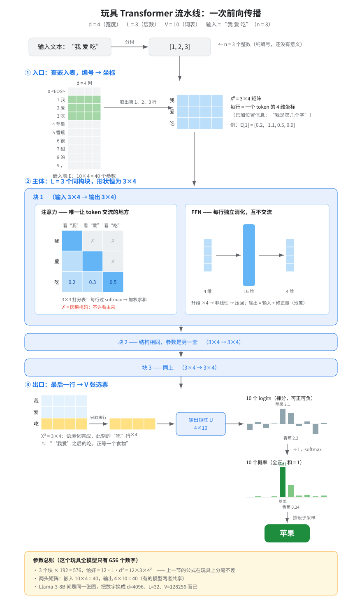
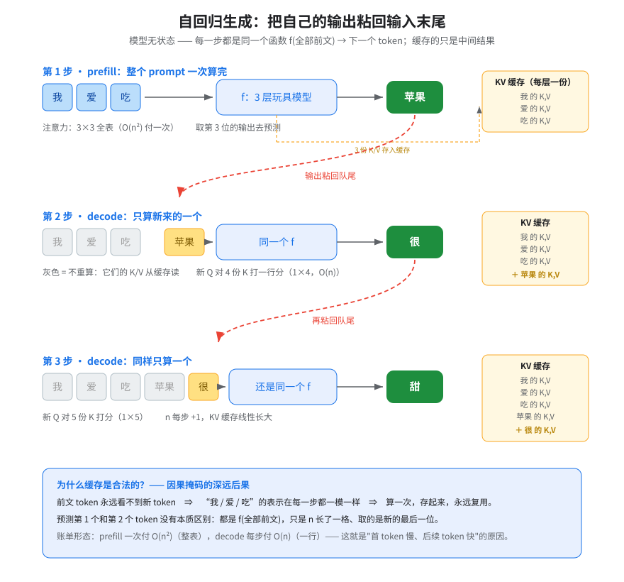

# 玩具 GPT 全流程走查：d=4，L=3，V=10

> 一句话总结：整个 GPT 就是一个函数——f(前文的 n 个整数) → 下一个位置的 V 个概率。形状只在入口（V×d 查表）和出口（d×V 打分）各变一次，中间 L 层恒为 n×d；所谓生成，就是把自己的输出粘回输入末尾，再调用一次 f。

这份笔记不是 `07-gpt-causal-language-modeling/docs/en.md` 的翻译，而是它的"实物教学版"：用一个小到能在纸上算完的玩具模型——**宽度 d = 4、层数 L = 3、词表 V = 10，全模型只有 656 个参数**——把流水线的每一个环节的输入、输出、形状、含义走一遍，重点回答三个最容易卡住人的问题：每一步到底进出什么；预测第 1 个和第 2 个 token 有什么不同、怎么衔接；KV cache 凭什么合法。

---

## 1. 舞台：一个 10 词的迷你世界

```text
词表（V = 10）：  0:<EOS>  1:我  2:爱  3:吃  4:苹果  5:香蕉  6:很  7:甜  8:的  9:，
输入 prompt：    "我爱吃"  →  分词后 [1, 2, 3]（n = 3 个 token）
```

全景先行——一次前向传播的每个环节和形状：




**最重要的形状事实**：中间无论叠多少层，数据的形状恒为 n×d——每个 token 一行、每行 d 个数。会变形状的只有两处：入口把"1 个编号"变成"d 维坐标"，出口把"d 维坐标"变成"V 张选票"。

---

## 2. 逐个环节：输入、输出、含义

### 入口：查嵌入表（编号 → 坐标）

嵌入表 E 的形状是 V×d = 10×4——**整张表就 40 个数字**。输入 ID 序列 [1, 2, 3]，动作只是取出第 1、2、3 行，得到 3×4 的矩阵 X⁰。每行再加上位置信息（"我是第几个字"），否则模型分不清"我爱吃"和"吃爱我"。

- 输入：3 个整数（无意义的编号）
- 输出：3×4 矩阵（每行 = 该 token 在意思空间的坐标，例如 E[1] = [0.2, −1.1, 0.5, 0.9]）
- 本质：查表，没有计算

### 块内单元 A：注意力（唯一让 token 交流的地方）

每行向量分身三份：Q（我在找什么）、K（我是什么）、V（我能提供什么）——各由一个 4×4 矩阵变换而来。然后所有 Q 对所有 K 打分，得到一张 **n×n 的相关性表**，n=3 时只有 9 个格子，可以整张写出来：

```text
            看"我"   看"爱"   看"吃"
  "我"行     1.00     ✗        ✗          ✗ = 因果掩码：不许看未来
  "爱"行     0.35     0.65     ✗          每行过 softmax 变成权重
  "吃"行     0.20     0.30     0.50       ← "吃"决定听 50% 自己、30% 爱、20% 我
```

每行拿权重对 V 向量加权求和——"吃"的新向量里从此掺进了"我"和"爱"的信息。**右上角被遮住的三个格子就是"因果"二字的全部含义**：训练和生成时，任何位置都只能看自己和过去。这张表也正是注意力 O(n²) 成本的本体。

- 输入：3×4　输出：3×4（形状不变，内容混入了前文）

### 块内单元 B：FFN（各自消化，互不交流）

每行**独立**通过一个小网络：4 维 → 16 维（升维 4 倍）→ 非线性 → 压回 4 维。不看别的行，就地加工刚从注意力收集来的信息。

- 输入：3×4　输出：3×4（逐行独立处理）

两个单元都是**残差式**的：输出 = 输入 + 修正量——每层只负责在原坐标上"修一笔"，这是几十层深的网络不失真的关键。

### 三块叠加：形状不变，语境化程度在变

X⁰(3×4) → 块1 → X¹ → 块2 → X² → 块3 → X³(3×4)。变的是每行内容的深度：**第 0 层的"吃"只是字典里的吃；到第 3 层，"吃"这一行已经变成了"'我爱'之后的那个吃，正在期待一个食物宾语"。**

### 出口：最后一行 → V 张选票

预测下一个 token，只取 X³ 的**最后一行**（"吃"的最终 4 维向量），乘以输出矩阵 U（d×V = 4×10），得到 10 个 **logits**（裸分，可正可负）；除以温度 T、过 softmax 变成 10 个概率；掷骰子采样——比如"苹果"以 0.61 的概率胜出。

- 输入：1×4　输出：10 个概率　含义：这个语境化向量给每个候选投多少票

---

## 3. 核心问题：预测第 2 个 token 和第 1 个有什么不同？

**概念上：没有任何不同。**模型是无状态的——它没有"记忆"这个器官，衔接方式简单粗暴：把刚生成的 token 粘回输入末尾，整条流水线重跑一遍：

```text
第 1 步： f([我, 爱, 吃])            → 取第 3 位输出 → "苹果"    n=3，注意力表 3×3
第 2 步： f([我, 爱, 吃, 苹果])      → 取第 4 位输出 → "很"      n=4，注意力表 4×4
第 3 步： f([我, 爱, 吃, 苹果, 很])  → 取第 5 位输出 → "甜"      n=5，注意力表 5×5
```

这就是"自回归"（autoregressive）的字面意思：**自己回头喂自己**。两步之间的全部区别：序列长一格、注意力表大一圈、取的是新的最后一位。

**工程上：第 2 步不必真的全部重算——KV cache 登场。**



关键在因果掩码的一个深远后果：**前文 token 永远看不到新 token，所以"我、爱、吃"三行的 K 和 V 在每一步都一模一样**——既然不变，算一次存起来就好。之后每步只算新 token 自己的 Q/K/V，新 Q 对缓存里全体 K 打**一行**分（1×n），而不是重算整张 n×n 的表。这正是推理两阶段账单的来源：

```text
prefill（第 1 步）： 整个 prompt 一次算完，付 O(n²)——首 token 慢在这里
decode（其后每步）： 只算一个新 token，付 O(n)——后续 token 快在这里
KV cache：          随 n 线性长大，长上下文吃显存的元凶
```

---

## 4. 训练和推理取的不一样：n 道并行考题

推理时只取最后一行去预测；**训练时 n 行全都要**——"我"行预测"爱"、"爱"行预测"吃"、"吃"行预测"苹果"（错一位对答案，即 shift-by-one，见原文 The loss 一节），每行各算一份交叉熵。一条 2048 长的打包序列就是 2048 道并行考题。这就是"训练并行、推理串行"：**训练一遍前向学 n 个位置，推理一遍前向只吐 1 个字**——因果掩码保证了训练时的并行不会作弊（每道考题都看不到自己的答案）。

---

## 5. 参数总账：玩具和 Llama 是同一张图

数一遍这个玩具的全部参数，顺便验证参数量公式：

```text
每块：  注意力 Q/K/V/O 四个 4×4 = 64      FFN 4×16 + 16×4 = 128      共 192
三块：  192 × 3 = 576   恰好 = 12·L·d² = 12 × 3 × 4²（公式分毫不差）
两头：  嵌入 10×4 = 40   输出 4×10 = 40（有的模型两者共享一张表）
合计：  约 656 个参数
```

真实的 Llama-3-8B 就是**同一张图**，把数字换成 d = 4096、L = 32、V = 128,256，再把注意力换成多头（4096 维切成 32 个头并行）而已——8B 个参数、一样的入口出口、一样的 n×d 形状恒定、一样的"粘回队尾"循环。你在这个 656 参数玩具上建立的每一条直觉，原样适用。

---

*本文对应 `phases/07-transformers-deep-dive/07-gpt-causal-language-modeling/docs/en.md`。它不是原文的翻译：原文讲因果掩码、shift-by-one 损失、解码策略与 GPT 配方，本文用 d=4、L=3、V=10 的玩具模型把整条流水线的形状与含义逐环节走查，并补充了原文未展开的自回归衔接细节与 KV cache 的合法性论证。配图为本课 docs/ 目录下的两张 SVG。嵌入、softmax、logits 的深入展开另见 `phases/10-llms-from-scratch/03-data-pipelines/docs/zh.md` 第 6 节的成本视角。*
