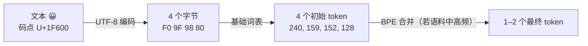

# 分词器：模型读的不是文字，是整数

> 一句话总结：LLM 只认整数，分词器决定同一段话要花掉多少个整数。花得多，上下文窗口、推理算力、API 账单三头吃亏。整个课题归结为三个环环相扣的决策：词表**建在什么地基上**（字符还是字节）、**怎么建**（合并还是剪枝）、**建多大**（32K 还是 200K）。

这份笔记不是 `01-tokenizers/docs/en.md` 的翻译。原文横向铺开了 BPE、WordPiece、SentencePiece 三大算法，这里按"三个决策"纵向重组，并把原文一句带过、但最容易卡住人的几个问题展开讲透：emoji 是怎么塞进 0–255 的字节词表的、cl100k_base 这种名字该怎么读、Unigram 的"裁员"到底怎么裁、词表大小那笔账怎么算、以及 Llama 3 为什么整个换掉了分词器。

---

## 1. 为什么说分词是"架构"，不是预处理

模型看到的 "Hello, world!" 是 `[15496, 11, 995, 0]`。从文字到整数序列的这一步转换不是中性的，它把三笔真金白银的账直接定了价：

- **上下文窗口按 token 计数。**同一篇文章切成 100 个 token 还是 70 个，决定了 128K 的窗口实际能装多少内容。
- **API 按 token 计费。**切得碎，同样的话更贵。
- **生成一个 token 就是一次完整的前向传播。**输出同样的内容，token 越多，推理越慢。

更要命的是不可逆：分词器在模型训练开始前就冻结了，它的每一个假设——哪些词是"整块"、数字怎么拆、中文按什么粒度切——都会烙进模型的权重里，之后无法更改。所以原文说：**tokenization is not preprocessing, it is architecture**（分词不是预处理，是架构决策）。

---

## 2. 三条老路，两条死路

把文本变成整数，有三种显而易见的做法，其中两种在规模化后都会死掉：

- **词级（word-level）**：按空格和标点切。看似自然，但英语就有上百万种词形，再加上代码、URL、德语复合词、一百种其他语言，词表趋于无限大。词表里没有的词只能标成 `[UNK]`（unknown）——模型举白旗说"这是啥我不认识"。
- **字符级（character-level）**：拆到单个字符。词表只要几百个，永无 UNK，但序列长度爆炸——10 个词的句子变成 50 个 token，而且模型得花宝贵的注意力容量去学"t、h、e 连着写是 the"这种人类三岁就会的事。
- **子词级（subword）**：甜蜜点。常用词保持整块（"the" 一个 token），生词拆成有意义的零件（"unhappiness" → `un | happi | ness`）。词表可控（30K–200K），序列不长，UNK 基本绝迹——任何词都能用零件拼出来。

现代 LLM 无一例外用子词分词。剩下的全部问题只是：**零件清单（词表）怎么造出来。**

---

## 3. BPE：把压缩算法改行做分词

BPE（Byte Pair Encoding）原本是 1994 年的一个数据压缩算法，被借来做分词。规则简单到能写在一张卡片上：

```text
1. 把语料全部拆成最小单位（字符）
2. 统计所有相邻对的出现次数
3. 把最频繁的一对合并成一个新 token，加入词表
4. 回到第 2 步，直到词表达到目标大小
```

用原文的迷你语料走两步。三个词："lower"×5、"lowest"×2、"newest"×6，全部拆成字符后统计相邻对，(w,e) 出现 13 次最多（三个词里都有），合并成 "we"；重新统计，(we,s) 出现 8 次，再合并成 "wes"……如此滚雪球，高频组合逐级长成完整的词根、词缀、整词。

两个要点比算法本身重要：

- **合并表就是分词器本体。**训练的产物是一张按顺序排列的合并规则表。给新文本分词 = 把这张表按学习时的顺序重放一遍。没有魔法，就是查表。
- **训练语料永久地塑造模型的世界。**语料里代码多，`def`、`self.` 就会长成整块 token，模型天生"读代码顺"；语料里中文少，汉字就被拆得粉碎。分词器训练完的那一刻，这些偏向就再也改不掉了。

---

## 4. Byte-level BPE：把地基从字符换成字节

标准 BPE 的最小单位是 Unicode 字符——这有个隐患：世界上有十几万个 Unicode 字符，词表不可能全收，撞上没收录的字符（一个生僻汉字、一个新 emoji）还是会掉进 UNK。

GPT-2 引入的 byte-level BPE 把地基再往下挖了一层：**最小单位不是字符，是字节。**任何文本先过一道 UTF-8 编码，变成 0–255 的字节流，BPE 的合并从这 256 个基础 token 上开始长。GPT-2 词表 50,257 的构成是一道漂亮的算术题：**256 个基础字节 + 50,000 条学到的合并 + 1 个特殊 token `<|endoftext|>`。**

### emoji 是怎么进 0–255 的词表的

乍一看矛盾：😀 的 Unicode 码点是 U+1F600，数值远超 255，怎么可能在字节词表里？答案是那道被一句话带过的 UTF-8 工序——emoji 在进词表之前就已经不是"一个字符"了：



一个 emoji 最终占几个 token，不是规定出来的，是**从语料里学出来的**：😀 够常见，`F0 9F`、`F0 9F 98 80` 这些相邻组合会被逐级合并，最后可能整只 emoji 一个 token；冷门 emoji 就停留在 2–4 个字节 token 的状态——和英语常用词长成整块、生僻词碎成零件是同一个机制。

这个设计换来了那句"never produces an unknown token"的底气：**任何字符串——任何语言、生僻字、甚至二进制乱码——都只是 0–255 的字节序列，而 256 个字节全在基础词表里。**最坏情况只是切得碎，绝不会切不动。

三个直接后果，都有工程意义：

1. **组合 emoji 更碎。**👨‍👩‍👧 看着是一个 emoji，实际是 5 个码点（男人 + 零宽连接符 + 女人 + 零宽连接符 + 女孩），UTF-8 下共 18 个字节——token 账单上往往是好几个。肤色修饰符同理。
2. **token 边界可以切在一个字符的半截上。**某个 token 可能只含 😀 四个字节里的前两个。流式输出时逐 token 解码，会先拿到非法的 UTF-8 前缀——解码器必须攒着字节等凑齐完整字符再显示，否则用户看到乱码闪烁。
3. **可视化工具里的怪字符是显示层戏法。**GPT-2 为了让字节可打印，把 256 个字节映射到一批可见 Unicode 字符上展示（空格显示成 `Ġ` 就是这么来的）。那是给人看的皮肤，词表里存的还是字节。

### 顺带读懂 tiktoken 的"型号名"

原文列了 cl100k_base（GPT-3.5/4，100,256 个 token）和 o200k_base（GPT-4o，200,019 个）。这些名字是 OpenAI 分词库 tiktoken 里"编码方案"的名字——每一个就是一套完整的分词器：固定的词表 + 合并表 + 特殊 token。名字分三段读：

```text
cl100k_base
│  │    └─ 变体：base = 基础版（同族可有变体，如 p50k_edit）
│  └─ 词表规模：约 100k
└─ 家族前缀：内部代号（o200k 的 o 一般认为对应 GPT-4o 的 omni）
```

模型和编码是两套体系、多对一的关系：GPT-3.5 和 GPT-4 共用 cl100k_base，Llama 3 的词表也建在 tiktoken 的 100K 基础之上（见第 8 节）。实践上要记住一件事：**数 token 时用错编码，算出来的成本和长度全是错的**——同一段文本在不同编码下 token 数不同。

---

## 5. WordPiece：不问"谁最常见"，问"谁最意外"

WordPiece（BERT 的分词器，词表 30,522）看起来像 BPE，但挑选合并对的标准不同：

```text
BPE 的合并标准：       count(A, B)                     —— 这对出现得最多吗？
WordPiece 的合并标准： count(AB) / (count(A)·count(B)) —— 这对一起出现的频率，超出"随机撞上"的预期多少？
```

区别在于分母。"t" 和 "h" 相邻次数极多，但 "t" 和 "h" 本身也到处都是，同框可能只是人海撞车；而两个各自不算高频的片段总是结伴出现，那就是真感情。**BPE 选最常见的一对，WordPiece 选最"意外"的一对**——统计上讲，它在最大化训练数据的似然，而不是原始频率。

WordPiece 还有个显眼的记号：非开头的子词带 `##` 前缀（"unhappiness" → `un | ##happi | ##ness`），表示"我是接在前面的"。见到 `##` 基本可以断定是 BERT 系。（小陷阱：RoBERTa 虽是 BERT 的近亲，用的却是 BPE。）

---

## 6. SentencePiece 与 Unigram：不预切分，以及"裁员式"建词表

BPE 和 WordPiece 传统上都先按空格把文本预切成词，再在词内部做子词切分。**SentencePiece 取消了预切分**：输入被当作原始字符流，空格本身也是一个普通字符。这让它真正做到语言无关——中文、日文、泰文这些不用空格分词的语言，终于不用先解决"什么是一个词"这个无解问题。Llama 2（SentencePiece BPE，32,000）和 T5（SentencePiece Unigram，32,000）都是用户。

SentencePiece 内置两种建词表算法：BPE 模式（合并逻辑同前）和 **Unigram 模式**——后者是 BPE 的镜像反面，值得单独讲透。

**BPE 是招聘，Unigram 是裁员。**BPE 从 256 个最小单位起步，每轮"聘用"最有价值的相邻对，词表一路**长大**到目标规模。Unigram 反着来：先撒网收一个巨大的候选词表（语料里所有高频子串，可达百万级），然后每轮问每个 token 一个残酷的问题——**"删了你，整个语料的似然会掉多少？"**——把最无关紧要的 10–20% 裁掉，词表一路**缩小**到目标规模。单字符永远保留，保证任何文本都拆得动。

"Unigram"这个名字指它背后的概率模型：每个 token 有独立的出现概率，一种切分方式的概率 = 各 token 概率的连乘（token 间互不依赖，故称"一元"）。分词时不查合并表，而是**在所有可能的切分里找连乘概率最大的那种**（Viterbi 动态规划求解）。迷你例子：

```text
词表片段：p("un") = 0.1   p("believable") = 0.02   p("unbeliev") = 0.005   p("able") = 0.08

"unbelievable" 的两种切法打分：
  "un" + "believable"   →  0.1  × 0.02 = 0.002     ← 胜出
  "unbeliev" + "able"   →  0.005 × 0.08 = 0.0004
```

训练时 token 概率用 EM 算法反复估计（按当前概率切分语料 → 按切分结果更新概率），穿插着裁员，直到词表达标。

它真正的杀手锏是：**切分不唯一，而且每种切法都带概率。**BPE 对同一文本永远输出同一种切分；Unigram 天然知道次优切法及其概率，于是训练模型时可以按概率**抽样**——同一个词这次切 `un|believ|able`，下次切 `unbeliev|able`。这相当于免费的数据增强，让模型对分词边界脱敏（这才是 Unigram 论文的原始动机，叫 subword regularization；BPE 阵营后来的 BPE-dropout 就是在模仿它）。

---

## 7. 词表多大才算好：一笔两头付费的账

词表规模是这一课里最"工程"的决策，难点在于它同时拉动两个方向相反、**付费方式不同**的成本：

- **成本 A：模型两头的矩阵（一次性，按参数付费）。**每个 token 要一行嵌入向量，输出端还有一个对称的投影矩阵给全词表打分。课文的账：128K 词表 × 4096 维 = **5.24 亿参数**（仅嵌入矩阵）；32K 词表只要 1.31 亿。一个分词器决策，4 亿参数的差距。
- **成本 B：序列长度（持续性，按请求付费）。**词表越大压缩越狠：同一段英文，32K 词表切 100 个 token，128K 词表可能只要 70 个——生成时少 30% 的前向传播。还有一笔隐藏放大：**注意力是 O(n²) 的**，序列长 43%（100/70），注意力计算量翻倍，压缩收益被平方放大。

付费方式不同决定了天平的走向：**矩阵的代价付一次，压缩的收益每个请求都在赚。**服务规模越大、模型越大（越养得起嵌入矩阵），越偏向大词表——这就是那条清晰的趋势线：GPT-2 50K → GPT-4 100K → Llama 3 128K → GPT-4o 200K，每词平均 token 数从 1.3 一路压到 1.0（常用英文单词几乎人手一个整块 token）。

但大词表有一个不显眼的暗病，正是对照图里小词表那侧 "Better rare-word handling" 的含义：**小词表把罕见词拆成常见碎片，每个碎片训练中出现过千万次，embedding 学得扎实；大词表收进的大量罕见整词 token 在语料里可能只出现几百次，embedding 严重欠训练。**这不是理论担忧——GPT-2/GPT-3 词表里著名的 "glitch tokens"（如 `SolidGoldMagikarp`）就是收进了词表却几乎没被训练过的 token，模型遇到它们时复读、报错、答非所问，行为完全失控。

检验自己是否真懂这个权衡，把词表推到两个极端：**退到 256（纯字节）**——矩阵最小、永无 UNK，但每个汉字 3 个 token 起步，O(n²) 直接炸掉，模型还得花容量学拼字；**推到无穷（每个词一个 token）**——序列最短，但回到词级分词的坟场：长尾全欠训练，UNK 复活。32K–256K 是当前的甜蜜区间，停在哪取决于模型规模、目标语言分布、推理成本敏感度。

---

## 8. 多语言税，以及 Llama 3 为什么整个换掉分词器

以英语为主的语料训出的分词器，对其他语言是残酷的：GPT-2 的词表下，韩文平均一个词 2–3 个 token，中文可以更糟。这意味着**非英语用户拿着打了对折的上下文窗口，按同样的 token 单价付费**——这就是"多语言税"。

这一课那行不起眼的备注——"Llama 3 switched to a tiktoken-based byte-level BPE tokenizer with 128,256 tokens"——背后是一次教科书级的换代决策，动机在 Meta 的论文《The Llama 3 Herd of Models》里写得明明白白：

1. **压缩效率**：新分词器把英语的压缩率从每 token 3.17 个字符提升到 3.94 个字符——同样的训练算力多"读"约四分之一的文本，同样的窗口多装内容，推理少走前向传播。
2. **多语言公平**：128K 词表 = **100K 直接取自 tiktoken（cl100k 一系、久经 GPT-4 验证的合并表）+ 28K 专门补给非英语语言的新 token**。论文明确说这 28K 同时改善了压缩率和下游性能，且不影响英语分词。
3. **工程复用**：实现直接用 tiktoken 库跑 byte-level BPE，顺带继承了成熟的好行为——比如数字按 1–3 位一组切（Llama 2 的 SentencePiece 一位一位切，对算术极不友好），以及 byte-level 的永无 UNK。

代价也如实付了：词表从 32K 涨到 128K，嵌入矩阵翻了四倍，在 8B 这种小模型上占比可观——上一节那笔"两头付费"的账，Llama 3 就是活例子：Meta 判断压缩收益作用于每一个被处理的 token，长期稳赚。

从 Llama 2 到 Llama 3 的这次换代，等于在三个决策上各投了一票：地基从字符换到**字节**，算法保持**合并**（BPE），规模从 32K 加到**128K**。

---

## 9. 收尾：三个决策，一张地图

| 决策 | 选项 | 决定了什么 |
|---|---|---|
| 地基建在什么上 | Unicode 字符 vs **原始字节** | 会不会撞 UNK；emoji、生僻字、乱码是否永远可切 |
| 词表怎么长出来 | **合并**（BPE：最常见对）vs 合并（WordPiece：最意外对）vs **剪枝**（Unigram：删了最不心疼的） | 词表长什么样；切分是否唯一、能否抽样正则化 |
| 词表长到多大 | 32K ←→ 200K | 序列长度与嵌入参数的交换比；多语言税率；长尾 token 的训练充分度 |

三个决策拼出的结论就是开头那句话的中文版：**分词不是预处理，是架构。**它在模型见到第一个训练样本之前，就已经决定了模型眼中世界的分辨率——哪些概念是一个整块，哪些永远是碎片，谁的语言享受一等舱，谁的语言在付税。

---

*本文对应 `phases/10-llms-from-scratch/01-tokenizers/docs/en.md`。它不是原文的翻译：略去了代码实现（字符级/BPE/WordPiece/Unigram 的从零实现与 tiktoken、Hugging Face tokenizers 用法见原文 Build It / Use It 部分），把篇幅集中在原文简要带过的机制上——UTF-8 字节桥与 emoji 的完整编码路径、tiktoken 编码命名的读法、WordPiece 合并标准的统计含义、Unigram 的概率模型与裁员流程、词表规模的成本结构，以及 Llama 3 换代分词器的公开动机（数字引自 Meta 论文《The Llama 3 Herd of Models》，arXiv:2407.21783）。*
